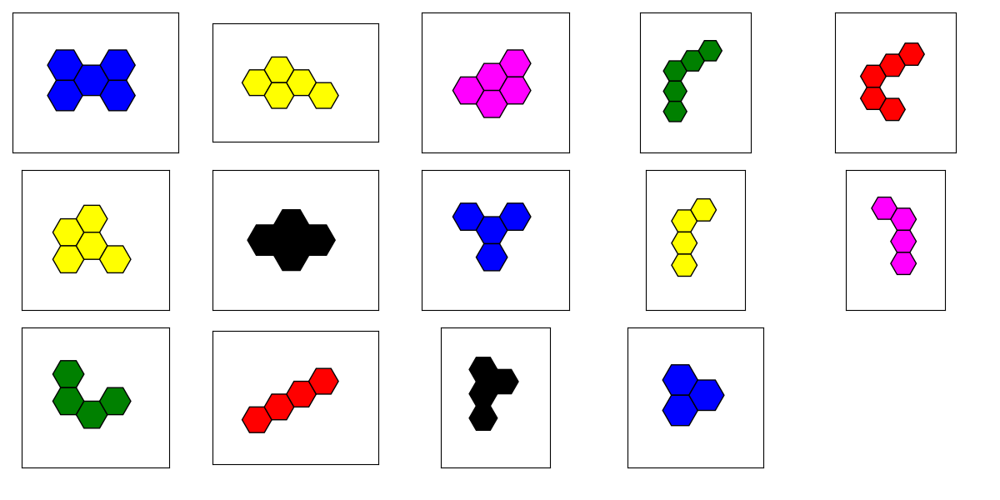

# hexagon-puzzle

There is this quite hard hexagonal puzzle with 14 pieces that I've been toying around with my kids. The goal is to fit all the pieces into one big hexagon shape:



After hundreds of trials that led me to find only one solution, I had a feeling that the puzzle was winning. So I've decided to ask backtracking algorithm to help me out and do the heavy lifting.

I first had to work in **oblique coordinate system** since shapes are hexagons, which I found fun. Then wrote `Piece` class and translation/rotation methods, as well as `Board` class with `put_piece` and `remove_piece` methods. At that point backtracking does all the job.

Considering number of possibilities is exponential, I knew it wouldn't be able to find all the solutions in a reasonable time, but sure I could give it a good head start, so the search space is much smaller. I also used some heuristic to speed it up like symmetry of some pieces (another one, that I didn't use, would be restricting placement of the next piece only next to existing ones).

After a day of tinkering with the code, it delivered! 

Behold the power of backtracking, here are some unique solutions (I reused some colors because I'm lazy, besides, I left at least some mystery in it!):


It took some time when search space was bigger but still, with 6 pieces left it took only 5 minutes (which is not optimal but meh):
```
2024-04-19 02:36:59,991 - INFO - For 3 leftover pieces, found 1 solutions in 1.12 seconds
2024-04-19 02:37:21,539 - INFO - For 4 leftover pieces, found 1 solutions in 8.32 seconds
2024-04-19 02:37:51,397 - INFO - For 5 leftover pieces, found 1 solutions in 17.57 seconds
2024-04-19 02:46:41,460 - INFO - For 6 leftover pieces, found 3 solutions in 316.52 seconds
2024-04-19 07:13:00,633 - INFO - For 8 leftover pieces, found 7 solutions in 15706.87 seconds
(don't have a plan to use CPU time nor mine anymore)
```

The kids are 4, until they grow up to understand all of this I'll mess with them that I have puzzle-solving superpowers.


